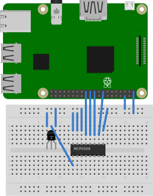

Temperature Sensor to MQTT Publisher for Raspberry Pi
=====================================================

This is a Python utility for communicating with a temperature sensor on a
Raspberry Pi in order to read the ambient (room) temperature. This project
supports two different temperature electronic components: a TC74 or a TMP36.
Read below for the pros and cons of each.


Software
--------

### Installation

```shell script
sudo pip3 install --upgrade pip
curl https://raw.githubusercontent.com/pypa/pipenv/master/get-pipenv.py | python
pipenv install
pipenv run python3 temp_to_mqtt.py
```


### Usage

```shell script
pipenv run python3 temp_to_mqtt.py
```


### System Service

```shell script
cd /etc/systemd/system
sudo ln -s <REPO_ROOT>/temp-mqtt-publish.service
sudo systemctl daemon-reload
sudo systemctl start temp-mqtt-publish.service
```

To view the logs from the systemctl service, run `journalctl -u temp-mqtt-publish.service`.


Hardware
--------

### Sensor Options

The [TC74] aka TC74A0 aka TC74A0-5.0VAT is a digital temperature sensor from
Adafruit that uses the I2C data protocol to send and receive data from a
controller device (e.g. a Raspberry Pi). Because it is a _digital_ sensor, it
spits out a ready-to-use digital reading of the temperature. This makes it easy
to work with but it is not the most precise temperature sensor.

The [TMP36], on the other hand, is a much more precise _analog_ temperature
sensor. Because it's an analog sensor, you'll have to use some sort of
Analog-to-Digital Converter (ADC) to convert the variable analog output to a
digital form that you can read and use in scripts. If your microcontroller or
single-board computer (like a Raspberry Pi) does not have a built-in ADC, you
can use the [MCP3008 ADC] to digitize the analog signals for you.


### Board Pins (on Raspberry Pi)

#### I2C Pins (for TC74)

I2C ports on Raspberry Pi are: GPIO (aka BCM) 2 for Data and GPIO 3 for Clock.

Run the `pinout` command to see the pins in the terminal on Rasperry Pi OS.
[pinout.xyz](https://pinout.xyz/pinout/i2c) is also a good reference.

| I2C Purpose | GPIO/BCM | Board Pin |
|-------------|----------|-----------|
| SDA (Data)  | GPIO 2   | Pin 3     |
| SCL (Clock) | GPIO 3   | Pin 5     |


#### SPI Pins (for TMP36)

| SPI Purpose                      | GPIO/BCM | Board Pin |
|----------------------------------|----------|-----------|
| SCLK (Clock)                     | GPIO 11  | Pin 23    |
| MISO (Master Input Slave Output) | GPIO  9  | Pin 21    |
| MOSI (Master Output Slave Input) | GPIO 10  | Pin 19    |


### Firmware

In order to enable the I2C or SPI functionality on a Raspberry Pi, you need to
run `sudo raspi-config` and go to _Interfacing Options > I2C/SPI > Enable_.
Then reboot with `sudo reboot`. If you're using I2C then you should be able to
run `sudo i2cdetect -y 1` without getting an error. It should display a blank
I2C address grid.

Source: [Adafruit Learn: GPIO Setup][LearnI2C]


### Sensor Pins

#### TC74

Assuming the TC74 chip used is of the TO-220 form factor, the 5 pins will be in
a straight line and are numbered 1 through 5 starting with 1 on the left and 5
on the right. According to the [TC74 datasheet], these pins are:

* Pin 1 (left): NC (Not used)
* Pin 2: SDA (I2C Data)
* Pin 3 (middle): GND
* Pin 4: SCLK (I2C Clock)
* Pin 5 (right): VDD (power supply)

**Note:** You probably need to add pull-down resistors to the SDA (I2C Data)
and SCLK (I2C Clock) pins. Otherwise RF interference from the environment might
cause those floating pins to always be "high" (positive voltage).

Connect these pins on the TC74 to your I2C controller or Raspberry Pi as
follows:

* TC74 VDD  -> 3.3V
* TC74 GND  -> Ground
* TC74 SDA  -> SDA (I2C Data; GPIO 2 on Raspberry Pi)
* TC74 SCLK -> SCL (I2C Clock; GPIO 3 on Raspberry Pi)

Then follow the instructions from the [TC74 Library README file][TC74Library]
to install and run the code necessary to read the temperature data from the
TC74.


#### TMP36

To learn how to connect and interface with the TMP36, follow the [TMP36 Guide
by Adafruit][LearnTMP36]. This guide assumes that your microcontroller has an
ADC built-in. If your microcontroller does not or if you are using a Raspberry
Pi, you'll need to get an MCP3008 and follow the [Analog Inputs Guide for
Raspberry Pi][LearnAnalog], also by Adafruit.


### Breadboard Diagrams

#### TMP36

If you're using the TMP36 sensor with a Raspberry Pi, you'll have to also use
an ADC chip like the MCP3008. Here is a diagram for how to wire up these
components on a breadboard.




Guides and Links
----------------

* [Adafruit TC74 Python Library][TC74Library]
* [Adafruit PCT2075 Python library](https://github.com/adafruit/Adafruit_CircuitPython_PCT2075)
* [I2C Guide by Adafruit Learn](https://learn.adafruit.com/circuitpython-basics-i2c-and-spi/i2c-devices)
* [SPI Guide by Adafruit Learn](https://learn.adafruit.com/circuitpython-basics-i2c-and-spi/spi-devices)
* [ADC Guide by Adafruit Learn](https://learn.adafruit.com/reading-a-analog-in-and-controlling-audio-volume-with-the-raspberry-pi/overview)


<!-- Links -->
[TC74]: https://www.adafruit.com/product/4375
[TMP36]: https://www.adafruit.com/product/165
[MCP3008 ADC]: https://www.adafruit.com/product/856
[LearnI2C]: https://learn.adafruit.com/adafruits-raspberry-pi-lesson-4-gpio-setup/configuring-i2c
[TC74 datasheet]: https://cdn-shop.adafruit.com/product-files/4375/4375_TC74A0-5.0VAT-Microchip-datasheet.pdf
[TC74Library]: https://github.com/adafruit/Adafruit_CircuitPython_TC74
[LearnAnalog]: https://learn.adafruit.com/reading-a-analog-in-and-controlling-audio-volume-with-the-raspberry-pi/overview
[LearnTMP36]: https://learn.adafruit.com/tmp36-temperature-sensor

<!-- vim: set textwidth=80: -->
